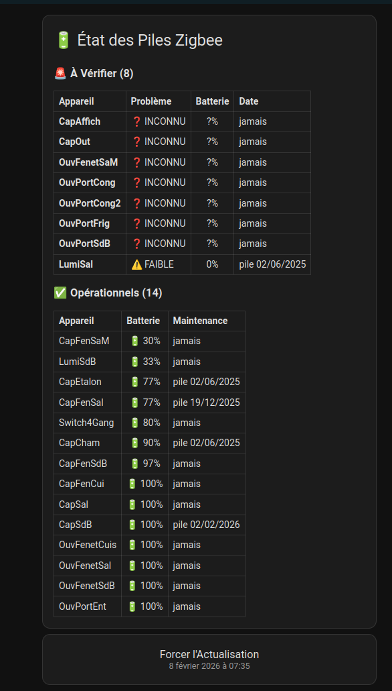

# Surveillance des Batteries Zigbee (Zigbee2MQTT)

Ce projet permet de surveiller l'état de santé de tous vos appareils Zigbee sur batterie. Il croise les données de **Zigbee2MQTT** (pour les métadonnées comme les dates de changement de pile) avec les états de **Home Assistant** (pour le niveau de pile et la disponibilité).

## 📂 Structure du Projet

- `zigbee_sensors.yaml` : Contient les capteurs template.
- `README.md` : Ce fichier de documentation.

## ⚠️ Pré-requis Important : Topic MQTT
Le fichier `zigbee_sensors.yaml` est configuré par défaut avec un topic spécifique : **`zigbee2mqtt02`**.
```yaml
- trigger:
    - platform: mqtt
      topic: zigbee2mqtt02/bridge/devices  <-- VÉRIFIEZ CE TOPIC !
```
Si votre installation Zigbee2MQTT utilise le topic par défaut (`zigbee2mqtt`), **vous devez modifier cette ligne** dans le fichier avant l'installation pour mettre : `zigbee2mqtt/bridge/devices`.

## 🛠️ Installation & Configuration

Pour que Home Assistant prenne en compte ce fichier, vous devez l'ajouter à votre configuration. Choisissez **UNE SEULE** des 3 méthodes ci-dessous selon votre architecture actuelle.

### Méthode 1 : Tout dans `configuration.yaml` (Débutant)
Si vous n'utilisez pas de fichiers séparés, copiez le contenu de `zigbee_sensors.yaml` directement dans `configuration.yaml` sous la clé `template:`.
⚠️ **Attention à l'indentation** : Vous devez ajouter 2 espaces au début de chaque ligne collée.
```yaml
template:
  - trigger: ...  <-- Notez le décalage
    platform: mqtt
    ...
```

### Méthode 2 : Via `templates.yaml` (Intermédiaire)
Si votre configuration ressemble à ça :
```yaml
template: !include templates.yaml
```
Copiez simplement tout le contenu de `zigbee_sensors.yaml` et collez-le à la fin de votre fichier `templates.yaml`.  
Aucune indentation supplémentaire n'est nécessaire (respectez juste l'alignement des tirets existants).

### Méthode 3 : Configuration Découpée « Merge List » (Expert)
C'est la méthode recommandée pour garder une configuration propre. Si vous avez ceci :
```yaml
template: !include_dir_merge_list templates/
```
1.  Créez un dossier `templates/` (s'il n'existe pas).
2.  Collez le fichier `zigbee_sensors.yaml` dans ce dossier.

> **Astuce de Migration** :
> Si vous migrez de la Méthode 2 vers la Méthode 3, vous pouvez simplement déplacer votre fichier `templates.yaml` existant vers le dossier `templates/`.
> Vous pourrez ensuite "découper" ce gros fichier par étapes ultérieurement.

Home Assistant fusionnera automatiquement tous les fichiers de ce dossier.

## ⚙️ Fonctionnement Technique

### 1. Le Capteur Maître (`sensor.z2m_battery_devices`)
Ce capteur est **déclenché par MQTT**. Il ne se met à jour que lorsque le bridge Zigbee2MQTT publie la liste de ses appareils (`zigbee2mqtt02/bridge/devices`).

- **État** : Nombre total d'appareils sur batterie détectés.
- **Attributs** : Une liste `devices` contenant pour chaque appareil :
    - `name` : Friendly name Z2M.
    - `status` : `online` ou `offline` (basé sur l'entité de batterie HA).
    - `battery` : Niveau en % (récupéré de HA).
    - `maintenance` : Date extraite de la description Z2M (formant "pile JJ/MM/AAAA").
    - `entity_debug` : L'ID de l'entité Home Assistant liée (pour vérification).

### 2. Le Capteur d'Alertes (`sensor.zigbee_battery_alerts`)
Ce capteur filtre la liste du capteur maître pour ne sortir que les appareils nécessitant une intervention humaine.

**Critères d'alerte :**
- Appareil marqué `offline`.
- Niveau de batterie `< 15%`.
- Niveau de batterie inconnu (`?`).

## 📋 Comment tenir à jour les dates ?
Pour que la date de changement de pile s'affiche :
1. Allez dans l'interface **Zigbee2MQTT**.
2. Cliquez sur un appareil > **Settings** (Paramètres).
3. Dans le champ **Description**, écrivez par exemple : `pile 02/02/2026`.
4. Le capteur se mettra à jour automatiquement à la prochaine publication du bridge.

## 🔄 Comment forcer une actualisation ?
Un bouton **"Actualiser Monitoring Zigbee"** est créé automatiquement via le fichier `zigbee_sensors.yaml`.
Il est intégré directement dans la carte Dashboard fournie (voir section suivante).

En cliquant dessus, vous forcez le recalcul immédiat des capteurs. Vous pouvez vérifier l'action en observant l'attribut `last_check` du capteur `sensor.z2m_battery_devices` qui change à chaque appui.

> [!NOTE]
> **Après un redémarrage de Home Assistant**, il est normal que beaucoup d'appareils apparaissent en "INCONNU" ou "0%" pendant quelques minutes.
> C'est le temps que Home Assistant rétablisse la connexion avec tous les capteurs (qui peuvent être en veille).
> Une fois le système stabilisé, un clic sur le bouton "Actualiser" remettra tout d'équerre.

## 📊 Bonus : Carte Dashboard
Pour afficher un joli tableau récapitulatif sur votre Dashboard :
1. Créez une nouvelle carte **"Manuel"**.
2. Copiez le contenu du fichier `dashboard_card.yaml`.
3. Vous aurez un tableau avec statut, batterie colorée et date de maintenance.



## 🤖 Automatisation : Rapport Journalier
Le fichier `zigbee_report.yaml` contient une automation clé en main qui :
1.  Se déclenche chaque soir (ex: 20h, configurable dans le fichier).
2.  Vérifie s'il y a des alertes en cours (`sensor.zigbee_battery_alerts > 0`).
3.  Génère un message sarcastique via le script **K-2SO**.
4.  Envoie une notification **Discord** détaillée (avec la liste des appareils) et une alerte visuelle sur **Awtrix**.

ℹ️ *Assurez-vous que ce fichier est bien pris en compte par votre configuration Home Assistant.*
