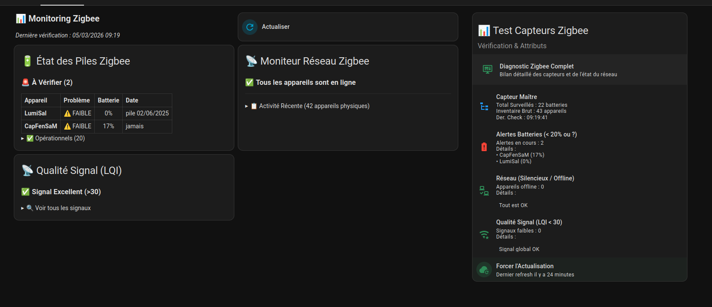

# Surveillance des Batteries Zigbee (Zigbee2MQTT)

Ce projet permet de surveiller l'état de santé de tous vos appareils Zigbee sur batterie. Il croise les données de **Zigbee2MQTT** (pour les métadonnées comme les dates de changement de pile) avec les états de **Home Assistant** (pour le niveau de pile et la disponibilité).

---

## 📑 Sommaire

| Section | Description |
|---------|-------------|
| [📂 Structure du Projet](#-structure-du-projet) | Liste des fichiers |
| [⚠️ Pré-requis MQTT](#️-pré-requis-important--topic-mqtt) | Configuration du topic |
| [🛠️ Installation](#️-installation--configuration) | 3 méthodes d'installation |
| [⚙️ Fonctionnement Technique](#️-fonctionnement-technique) | Explication des capteurs |
| [📊 Cartes Dashboard](#-cartes-dashboard) | Affichage visuel |
| [🤖 Automatisation](#-automatisation--rapport-journalier) | Notifications et rapports |
| [🧪 Comment Tester](#test-1--simuler-une-alerte-outils-de-développement--états) | Tests et debug |
| [🔧 Compatibilité](#-compatibilité) | Corrections appliquées |

---

## 📂 Structure du Projet

```
monitoring-zigbee/
├── method_package/                  # OPTION A : La Méthode "Package" (Capteurs seuls - V1.1)
│   └── zigbee_monitoring_package.yaml # Les capteurs (Automation commentée, utiliser le Blueprint)
│
├── method_template/                 # OPTION B : La Méthode "Classique" (yaml séparés)
│   ├── zigbee_sensors.yaml          # Capteurs (inventaire, alertes, réseau)
│   ├── zigbee_report.yaml           # Automation standard (Pour archive/exemple)
│   └── zigbee_report_perso.yaml     # Automation personnalisée (Exemple complexe)
│
├── zigbee_report_blueprint.yaml     # 🧩 LE BLUEPRINT OFFICIEL (Recommandé pour l'automatisation)
├── Dashboard/                       # Cartes Dashboard pour l'UI
│   ├── dashboard_unified_grid.yaml  # Carte Dashboard (Commune aux 2 méthodes)
│   └── test_mushroom_card.yaml      # Carte test Mushroom avec attributs
├── archive/                         # Anciens fichiers
└── README.md                        # Ce fichier
```

## ⚠️ Pré-requis : Topic MQTT
Les fichiers (Package ou Template) sont configurés par défaut avec le topic classique de Zigbee2MQTT : **`zigbee2mqtt`**.
Si vous avez personnalisé votre topic de base (ex: `zigbee2mqtt_maison`), pensez à le modifier aux endroits dédiés dans le code YAML des capteurs !

## 🛠️ Installation & Configuration

Pour installer ce projet, choisissez **UNE SEULE** des 2 méthodes ci-dessous.

### 🌟 Méthode 1 : Le Package + Blueprint (Recommandée)
C'est la plus simple et la plus modulable grâce au Blueprint (V1.1).

1. Vérifiez que vous avez ceci dans `configuration.yaml` :
```yaml
homeassistant:
  packages: !include_dir_named packages
```
2. Créez le dossier `/config/packages/` s'il n'existe pas.
3. Copiez le fichier `method_package/zigbee_monitoring_package.yaml` dedans.
4. Importez le Blueprint `zigbee_report_blueprint.yaml` dans Home Assistant.
5. Créez une automatisation basée sur ce Blueprint depuis l'interface UI.
6. Redémarrez Home Assistant.

> [!TIP]
> **Pourquoi le Blueprint ?** L'automatisation incluse dans le package a été désactivée (commentée). Le Blueprint vous permet de gérer facilement l'heure du rapport, l'ajout de notifications personnalisées (Discord, Mobile App) via l'interface UI de HA sans toucher au code !

### ⚙️ Méthode 2 : Les Fichiers "Split" (Avancé)
Si vous préférez séparer vos capteurs et vos automatisations (méthode classique).

**1. Les Capteurs (`zigbee_sensors.yaml`)**
Copiez `method_template/zigbee_sensors.yaml` via votre méthode habituelle (soit dans `configuration.yaml` sous `template:`, soit dans votre dossier `templates/`).

**2. L'Automatisation (`zigbee_report.yaml`)**
Copiez le contenu de `method_template/zigbee_report.yaml` dans une nouvelle automatisation (mode YAML) ou dans votre fichier `automations.yaml`.

**3. Redémarrez Home Assistant.**

## ⚙️ Fonctionnement Technique

### 1. Le Capteur Maître (`sensor.z2m_battery_devices`)
Ce capteur écoute **deux sources MQTT** :
1.  `zigbee2mqtt/bridge/devices` : Pour l'inventaire complet des appareils (déclenché rarement).
2.  `zigbee2mqtt/+` : Pour le trafic temps réel (mise à jour de l'attribut `last_seen_registry`).

- **État** : Nombre total d'appareils sur batterie détectés.
- **Attributs clés** :
    - `last_seen_registry` : Dictionnaire stockant l'heure de dernier passage de chaque appareil qui "parle".
    - `devices` : Liste enrichie des appareils sur batterie (nom, statut, pile, date maintenance).
    - `raw_devices` : Données brutes de l'inventaire Z2M.

### 2. Le Capteur Réseau (`sensor.z2m_network_monitor`)
Ce capteur analyse `last_seen_registry` pour détecter les appareils "silencieux" depuis trop longtemps (par défaut : **> 12h**). Les appareils signalés indisponibles par défaut dans Home Assistant (`unavailable`) y sont également inclus.

> [!NOTE]
> **Pourquoi un trigger `time_pattern` (toutes les 15 min) ?**
> L'attribut `last_seen_registry` est mis à jour à **chaque message MQTT** (potentiellement des centaines par minute).
> Sans ce timer, le capteur recalculerait inutilement à chaque message reçu, gaspillant des ressources.
> Le délai de 15 minutes est un bon compromis entre réactivité et performance.

### 3. Le Capteur Qualité Signal (`sensor.z2m_lqi_monitor`)
Ce capteur analyse la qualité du signal (LQI - Link Quality Indication) de chaque appareil qui communique.

- **Seuil "faible"** : `< 30` (configurable dans le code).
- **Mise à jour** : Toutes les 15 minutes.
- **But** : Affichage visuel uniquement dans le Dashboard (pas d'alerte).

### 4. Le Capteur d'Alertes (`sensor.zigbee_battery_alerts`)
Ce capteur filtre la liste du capteur maître pour ne sortir que les appareils nécessitant une intervention humaine.

**Critères d'alerte :**
- Niveau de batterie `< 20%` (Modifié en V1.1).
- Niveau de batterie inconnu (`?`).

*(Note : Les appareils signalés hors-ligne ou silencieux ne sont plus comptabilisés ici, ils ont leur propre alerte réseau dédiée).*

## 📋 Comment tenir à jour les dates ?
Pour que la date de changement de pile s'affiche :
1. Allez dans l'interface **Zigbee2MQTT**.
2. Cliquez sur un appareil > **Settings** (Paramètres).
3. Dans le champ **Description**, écrivez par exemple : `pile 02/02/2026`.
4. Le capteur se mettra à jour automatiquement à la prochaine publication du bridge.

## 🔄 Comment forcer une actualisation ?

Un bouton **"Actualiser Monitoring Zigbee"** est créé automatiquement via le fichier `zigbee_sensors.yaml`. Il est intégré directement dans les cartes Dashboard fournies.

En cliquant dessus, vous forcez le recalcul immédiat des **deux capteurs** :
- `sensor.z2m_battery_devices` (inventaire et batteries)
- `sensor.z2m_network_monitor` (appareils silencieux)

Vous pouvez vérifier l'action en observant l'attribut `last_check` qui change à chaque appui.

> [!NOTE]
> **Après un redémarrage de Home Assistant**, il est normal que beaucoup d'appareils apparaissent en "INCONNU" ou "0%" pendant quelques minutes.
> C'est le temps que Home Assistant rétablisse la connexion avec tous les capteurs (qui peuvent être en veille).
> Une fois le système stabilisé, un clic sur le bouton "Actualiser" remettra tout d'équerre.

### Dashboard Unifié (Vue "Sections")
Fichier : `Dashboard/dashboard_unified_grid.yaml`

Cette carte regroupe **Batteries + Réseau + Bouton Actualiser** en une seule grille optimisée.

**Installation Spécifique "Vue Sections" :**
1. Créez une nouvelle Section dans votre dashboard.
2. Cliquez sur le crayon (Editer) de la section.
3. Passez en éditeur YAML (souvent via les 3 points ou "Afficher l'éditeur de code").
4. Collez l'intégralité du contenu de `Dashboard/dashboard_unified_grid.yaml`.


**Aperçu des deux cartes (Mushroom et native) :**


> [!NOTE]
> Les anciennes cartes séparées (`dashboard_card.yaml`, `dashboard_network_card.yaml`, etc.) ont été déplacées dans le dossier `archive/` pour clarté.

## 🤖 Automatisation : Le Blueprint V1.1

La gestion des notifications se fait désormais via le **Blueprint officiel** (`zigbee_report_blueprint.yaml`).

| Trigger | Description |
|---------|-------------|
| `scheduled` | Rapport quotidien à l'heure choisie via l'interface (défaut : 20h00) |
| `ha_start` | Au démarrage de HA (Avec délai configurable, défaut : 5 minutes) |
| `battery_alert` | Dès qu'une batterie passe sous le seuil critique (< 20%) |
| `network_alert` | Dès qu'un appareil devient silencieux |

**Avantages du Blueprint :**
1. **Entités détectées automatiquement** (si installation via ce tuto).
2. **Interface Graphique** : Plus besoin de toucher au YAML pour changer l'heure du rapport.
3. **Actions Personnalisées** : Un bloc vous permet d'ajouter très simplement n'importe quelle notification (Mobile App, Discord, Telegram...) en complément de la notification persistante de Home Assistant.

### ✨ Les variables du Blueprint
Lorsque vous ajoutez une action personnalisée via l'interface, vous pouvez insérer ces variables exactes dans vos champs de message :

- `{{ message_title }}` : Titre dynamique (ex: *"🚨 Rapport Zigbee - 2 alerte(s)"* ou *"✅ Rapport Zigbee - Tout OK"*)
- `{{ message }}` : Le fameux rapport complet formaté avec les listes.
- `{{ alert_summary }}` : Un résumé ultra-court (ex: *"2 alerte(s) batterie et 1 appareil(s) silencieux"*). Idéal pour un TTS Alexa/Google ou l'objet d'un mail !
- `{{ battery_count }}`, `{{ network_count }}`, `{{ total_zigbee }}` : Les compteurs bruts (utile si vous voulez faire des conditions `choose` dans vos actions).

**Exemple de ce que contient la variable `{{ message }}` :**
```text
📊 Réseau : 43 appareils Zigbee (31 sur batterie)

⚠️ BATTERIES (2 alertes)
• CapFenSaM : 🪫 BATTERIE 17% (Maintenance : pile 14/08/2026)
• LumiSal : 🪫 BATTERIE 0% (Maintenance : pile 02/06/2025)

📡 RÉSEAU (1 silencieux)
• LedPlanCul : 📡 SILENCIEUX depuis 1h (Maintenance : jamais)

---
🔍 DÉCLENCHEUR : scheduled
```

**Exemple d'action personnalisée (Notification sur l'App Mobile) :**
```yaml
action: notify.mobile_app_mon_iphone
data:
  title: "{{ message_title }}"
  message: "{{ message }}"
```

 *(Ajouter image au besoin)*

### Test 1 : Simuler une alerte (Outils de développement > États)

1. Allez dans **Outils de développement > États**
2. Cherchez `sensor.zigbee_battery_alerts` ou `sensor.z2m_network_monitor`
3. Changez l'état de `0` à `1`
4. Cliquez **"Définir l'état"**
5. L'automation devrait se déclencher immédiatement → notification persistante créée

### Test 2 : Exécuter l'automation manuellement

1. Allez dans **Paramètres > Automatisations**
2. Trouvez "Zigbee : Rapport Journalier (Simplifié)"
3. Cliquez sur les 3 points > **Exécuter**
4. Vérifiez la notification persistante créée

### Test 3 : Vérifier le cas "Tout OK"

1. Dans **Outils de développement > États**, mettez les deux sensors à `0` :
   - `sensor.zigbee_battery_alerts` = `0`
   - `sensor.z2m_network_monitor` = `0`
2. Exécutez l'automation manuellement (voir Test 2)
3. Vous devriez recevoir une notification "✅ Rapport Zigbee - Tout OK"

> [!TIP]
> Les notifications persistantes s'empilent (elles ne se remplacent pas).
> Pour les effacer, cliquez sur "Ignorer" ou allez dans **Notifications** de HA.

